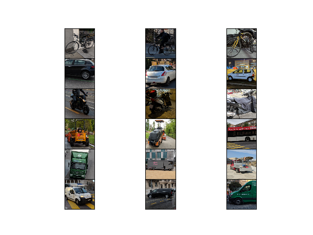
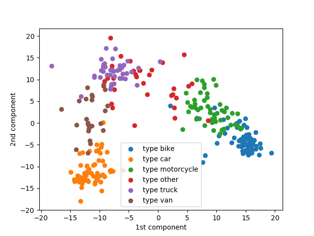

.. vim: set fileencoding=utf-8 :

.. _swissroads_iris_userguide:

============
 User Guide
============

This guide explains how to use this package and obtain results published in our
paper.  Results can be re-generated automatically by executing the following
command:

.. code-block:: sh

   (swissroads_conda_env) $ python results.py

For your reference, the result tables are repeated below, so you can check the
reproducibility of our solution.

The dataset
-----------

The original provided "Swissroads" data set is provided by  - EPFL Extension School.
It is composed of 469 images in format .png file 256x256 pixels.
It contains images of bike,car,motorcycle,truck,van and other categories.
The dataset is already splitted into train/test and Valid sets.

Below an example of image containing a car to be recognized as a car by our program.

.. image:: img/car.png
  :width: 400
  :alt: Example of a car in image

Data Exploration
------------------

Below a picture containing all categories of objects in the images dataset:

The below picture contains a plot obtained running the function data_exploration.apply_PCA()

Results for baseline
---------------------

 baseline - logistic regression :
   train accuracy :  1.0
   test accuracy :  0.94

Baseline confusion matrix:

============= =========== ======= ============== ======= ======= =======
  label          bike      car     motorcycle    other   truck    van
============= =========== ======= ============== ======= ======= =======
 bike             **12**      0            0         0       0       0
 car               0      **11**           0         0       0       0
 motorcycle        0       0           **9**         0       0       0
 other             0       0           0         **6**       0       0
 truck             0       0           0         2       **5**       0
 van               0       1           0         0           0    **4**
============= =========== ======= ============== ======= ======= =======

Results for tensorflow 2-layers Neural network:
------------------------------------------------

Neural network model :
train accuray 2-layer dense : 0.979
test accuray 2-layer dense : 0.960

NN confusion matrix:

============= =========== ======= ============== ======= ======= =======
  label          bike      car     motorcycle    other   truck    van
============= =========== ======= ============== ======= ======= =======
 bike             **12**      0            0         0       0       0
 car               0      **10**           0         0       1       0
 motorcycle        0       0           **9**         0       0       0
 other             0       0           0         **6**       0       0
 truck             0       0           0         0       **7**       0
 van               0       1           0         0           0    **4**
============= =========== ======= ============== ======= ======= =======

